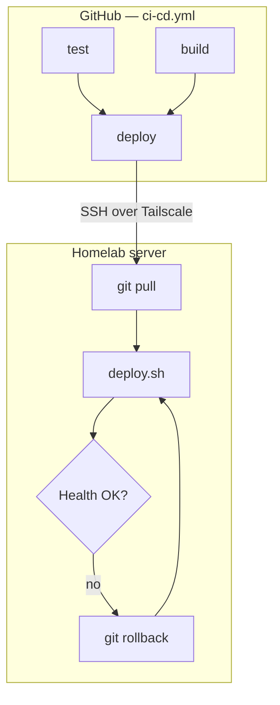

# Homelab deploy pipeline

Generic CI/CD documentation for this template. Copy unchanged into new projects.

App-specific setup lives in the project `README.md`. Shared config lives in **`config.env`** (committed).

---

## Architecture



| Event | What runs |
|-------|-----------|
| PR or push | `test` + `build` (parallel) |
| Push to `main` | `test` + `build` → `deploy` (only if both pass) |
| Deploy failure | Automatic git rollback + redeploy previous version |

---

## Configuration

**`config.env`** — committed, safe to share (ports, names, paths). Edit on laptop, push to git; server picks it up on `git pull`. No manual server setup.

**`.env`** — optional, gitignored. Secrets and local overrides only.

| Variable | Purpose |
|----------|---------|
| `APP_NAME` | Docker container name |
| `HOST_PORT` | Port published on host |
| `APP_PORT` | Port inside container |
| `HEALTH_PATH` | Health check path |
| `DEPLOY_BRANCH` | Branch pulled on deploy |
| `DEPLOY_PATH` | Server clone path (match GitHub repo variable) |

Load order: `config.env` → `.env` (overrides) → defaults in compose.yaml.

New app:

```bash
./scripts/init-project.sh my-api 8080
```

---

## GitHub configuration

| Scope | What to set |
|-------|-------------|
| **Organization** | `TS_OAUTH_*`, `HOMELAB_*` secrets; `TS_TAGS` variable |
| **Repository** | `DEPLOY_PATH` variable (must match `config.env`) |

Details: [secrets.md](secrets.md)

---

## Files that define the pipeline

| File | Role |
|------|------|
| `config.env` | Committed project config |
| `.github/workflows/ci-cd.yml` | Test, build, deploy jobs |
| `scripts/deploy.sh` | Compose up, health check, rollback |
| `scripts/load-env.sh` | Loads config.env + optional .env |
| `compose.yaml` | Base compose |
| `compose.prod.yaml` | Server overrides |

Copy pipeline files unchanged into new projects; edit `config.env` per app.

---

## Server setup

One-time per app: [server-setup.md](server-setup.md)

GitHub Actions SSH script:

```text
git pull origin main
DEPLOY_PULL=0 ./scripts/deploy.sh
```

Manual deploy on server:

```bash
DEPLOY_PULL=1 ./scripts/deploy.sh
```

No `cp .env` on the server — `config.env` arrives via git.

---

## Automatic rollback

When deploy runs (after `git pull`), `deploy.sh`:

1. Saves current git commit
2. `git pull origin $DEPLOY_BRANCH`
3. Deploys and health-checks
4. On failure: `git reset --hard` to saved commit, redeploys, exits 1

---

## Day-to-day workflow

```text
1. Edit config.env and/or code on laptop
2. make test
3. git push
4. PR → test + build
5. Merge to main → deploy (config.env on server updated via git pull)
```

---

## Troubleshooting

| Problem | Fix |
|---------|-----|
| Wrong port | Change `HOST_PORT` in `config.env`, push |
| Health check fails | Ensure app serves `HEALTH_PATH` on `APP_PORT` |
| `docker logs` | Use `APP_NAME` from `config.env` |

---

## Reusing as a template

See [TEMPLATE.md](../TEMPLATE.md).
